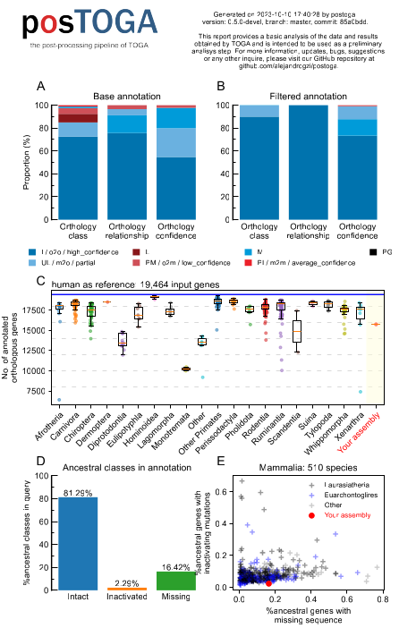

> [!WARNING]
>
> postoga is dependent from [TOGA](https://github.com/hillerlab/TOGA). Any changes in TOGA will have a repercusion here. If you found any bug/errors, please report them here.
> This project is in constant development, any desired features are welcome!


# postoga

The post-[TOGA](https://github.com/hillerlab/TOGA) processing pipeline.


<p align="center">
    
</p>

<!--  -->

## What's new on version 0.9.3-devel

> - Re-implementation of postoga to match TOGA2.0 output
> - Includes self-owned rust bed to gtf coverters through rustools
> - Forces bed2gtf, bed2gff and gxf2bed installation for quick access
> - Adds --extract to extract filtered projections from codon and protein alignments
> - Implements --engine option to use polars
> - Now manages configuration and test through 'make configure' and 'make test'
> - Adds license
> - Drops --skip argument and adds --plot argument to plot stats [currently broken]
> - Adds additional BUSCO and completeness stats to the main log file

## Usage

To use postoga, just:

Clone the repository
```bash
# clone the repository
git clone --recursive https://github.com/alejandrogzi/postoga.git
cd postoga
```

Activate the environment and configure binaries
```bash
pip install hatch
make configure
```

Run test to confirm functionality [you can run the test directly from the configuration step]
```bash
make test
```

If you see something like this at then end, postoga is ready!:

```text
> postoga: the post-TOGA processing pipeline
> version: 0.9.3-devel[2024-10-15 12:25:05] - INFO: postoga started!
[2024-10-15 12:25:05] - INFO: running in mode base with arguments: {'mode': 'base', 'outdir': '/Users/alejandrogzi/Documents/projects/postoga/POSTOGA_TEST', 'togadir': '/Users/alejandrogzi/Documents/projects/postoga/supply/test', 'by_class': 'I,PI', 'by_rel': None, 'threshold': 0.95, 'to': 'gtf', 'assembly_qual': PosixPath('/Users/alejandrogzi/Documents/projects/postoga/supply/Ancestral_placental_complete.txt'), 'species': 'human', 'source': 'ensembl', 'phylo': 'mammals', 'plot': False, 'paralog': None, 'isoforms': None, 'engine': 'pandas'}
[2024-10-15 12:25:05] - INFO: found 52 projections, 49 unique transcripts, 44 unique genes
```

Here is a descrption of postoga features:

> [!TIP]
>
> If the only thing you want to do is apply some filters to a TOGA result or convert results to GTF/GFF files, I recommend the following command:
>
> ```bash
> ./postoga.py base \
> --togadir /your/TOGA/dir \
> --outdir /your/out/dir \
> -bc [YOUR CLASSES] \
> -br [YOUR RELATIONS] \
> -th [YOUR THRESHOLD] \
> -to [YOUR FORMAT GTF/GFF/BED] \
> ```

```text
usage: postoga.py [-h] {base,haplotype}

positional arguments:
  {base,haplotype}  Select mode
    base            Base mode
    haplotype       Haplotype mode

postoga.py base [-h] --outdir OUTDIR --togadir TOGADIR [-bc BY_CLASS] [-br BY_REL]
                       [-th THRESHOLD] -to {gtf,gff,bed} [-aq ASSEMBLY_QUAL]
                       [-sp {human,mouse,chicken}] [-src {ensembl,gene_name,entrez}]
                       [-phy {mammals,birds}] [-s] [-par PARALOG]

optional arguments:
  -h, --help            show this help message and exit
  --outdir OUTDIR, -o OUTDIR
                        Path to posTOGA output directory
  --togadir TOGADIR, --td TOGADIR
                        Path to TOGA results directory
  -bc BY_CLASS, --by-class BY_CLASS
                        Filter parameter to only include certain orthology classes (I, PI, UL, M, PM,
                        L, UL)
  -br BY_REL, --by-rel BY_REL
                        Filter parameter to only include certain orthology relationships (o2o, o2m,
                        m2m, m2m, o2z)
  -th THRESHOLD, --threshold THRESHOLD
                        Filter parameter to preserve orthology scores greater or equal to a given
                        threshold (0.0 - 1.0)
  -to {gtf,gff,bed}, --to {gtf,gff,bed}
                        Specify the conversion format for .bed (query_annotation/filtered) file (gtf,
                        gff3) or just keep it as .bed (bed)
  -aq ASSEMBLY_QUAL, --assembly_qual ASSEMBLY_QUAL
                        Calculate assembly quality based on a list of genes provided by the user
                        (default: Ancestral_placental.txt)
  -sp {human,mouse,chicken}, --species {human,mouse,chicken}
                        Species name to be used as a reference for the assembly quality calculation
                        (default: human)
  -src {ensembl,gene_name,entrez}, --source {ensembl,gene_name,entrez}
                        Source of the ancestral gene names (default: ENSG)
  -phy {mammals,birds}, --phylo {mammals,birds}
                        Phylogenetic group of your species (default: mammals)
  -par PARALOG, --paralog PARALOG
                        Filter parameter to preserve transcripts with paralog projection probabilities
                        less or equal to a given threshold (0.0 - 1.0)
  -iso ISOFORMS, --isoforms ISOFORMS
                        Path to a custom isoform table (default: None)
  -e {pandas,polars}, --engine {pandas,polars}
                        Database engine to create inner db representations (default: pandas)
  -p, --plot            Flag to plot statistics about the filtered genes (default: False)
  -ext [{query,reference}], --extract [{query,reference}]
                          Flag or option to extract sequences (only codon and protein alignments) from the filtered genes. Can be 'query', 'reference', or just set as a flag
                          (default: False). When used as a flag extracting 'query' sequences is default.

postoga.py haplotype [-h] --outdir OUTDIR -hp HAPLOTYPE_DIR [-r RULE] [-s {query,loss}]

optional arguments:
  -h, --help            show this help message and exit
  --outdir OUTDIR, -o OUTDIR
                        Path to posTOGA output directory
  -hp HAPLOTYPE_DIR, --haplotype_dir HAPLOTYPE_DIR
                        Path to TOGA results directories separated by commas (path1,path2,path3)
  -r RULE, --rule RULE  Rule to merge haplotype assemblies (default: I>PI>UL>L>M>PM>PG>abs)
  -s {query,loss}, --source {query,loss}
                        Source of the haplotype classes (query, loss)
```
